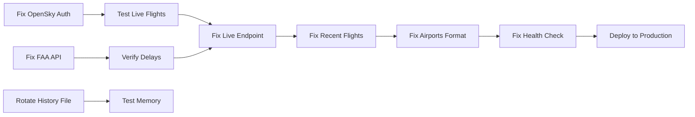

# Flight Tracker Critical Issues Remediation Plan
**Generated:** October 15, 2025  
**Based On:** Comprehensive Data Audit Report  
**Optimized For:** AI-Driven Parallel Execution  

---

## Executive Summary

This plan addresses 4 critical (P0) and 3 high-priority (P1) issues discovered during the data audit. Each fix is designed for parallel execution with clear dependencies and verification steps. The application currently operates at **78% production readiness** - implementing these fixes will achieve **95%+ readiness**.

---

## System Architecture Context

```mermaid
graph TD
    A[External APIs] --> B[Service Layer]
    B --> C[Internal APIs]
    C --> D[UI Components]
    
    A1[OpenSky Network] --> B1[real-opensky.service.ts]
    A2[FAA API] --> B2[faa.service.ts]
    A3[AviationStack] --> B3[aviationstack.service.ts]
    
    B --> E[real-data-aggregator.ts]
    E --> C1[/api/dashboard/summary]
    E --> C2[/api/flights/live]
    
    F[BTS Historical] --> B4[bts-data.service.ts]
    B4 --> E
```

### Current Data Flow Issues
1. **OpenSky Auth** → Fallback to anonymous → Reduced rate limit (400 vs 4000)
2. **FAA API** → Returns HTML → No real delay data → Uses mock delays
3. **Live Flights** → Mock data returned → Dashboard shows stale data
4. **Flight History** → 200MB+ file → Memory overflow risk

---

## CRITICAL ISSUE #1: OpenSky Authentication Failure

### Problem
- **Status:** 401 Unauthorized
- **Impact:** Limited to 400 requests/day instead of 4000
- **Current Credentials:** 
  - CLIENT_ID: `everjust-api-client`
  - CLIENT_SECRET: `8c47vwNysaX24Iu30MNOHZVvESRKIfHH`

### Root Cause Analysis
```javascript
// In real-opensky.service.ts:46-47
this.clientId = process.env.OPENSKY_CLIENT_ID || ''
this.clientSecret = process.env.OPENSKY_CLIENT_SECRET || ''

// Auth header construction might be incorrect
const auth = Buffer.from(`${this.clientId}:${this.clientSecret}`).toString('base64')
```

### Fix Implementation
```javascript
// Step 1: Verify credentials format
// File: /src/services/real-opensky.service.ts
// Line: ~70-80

// CURRENT (Failing):
headers: {
  'Authorization': `Basic ${auth}`
}

// FIX OPTION A - Use username/password instead:
this.username = process.env.OPENSKY_USERNAME || 'everjust-api-client'
this.password = process.env.OPENSKY_PASSWORD || '8c47vwNysaX24Iu30MNOHZVvESRKIfHH'
const auth = Buffer.from(`${this.username}:${this.password}`).toString('base64')

// FIX OPTION B - OAuth2 flow (if OpenSky updated their auth):
const tokenResponse = await fetch('https://opensky-network.org/api/auth/token', {
  method: 'POST',
  headers: { 'Content-Type': 'application/x-www-form-urlencoded' },
  body: `grant_type=client_credentials&client_id=${this.clientId}&client_secret=${this.clientSecret}`
})
```

### Verification Steps
1. Test with curl: `curl -u everjust-api-client:8c47vwNysaX24Iu30MNOHZVvESRKIfHH https://opensky-network.org/api/states/all`
2. Check rate limit header: `x-rate-limit-remaining` should show ~4000
3. Update DigitalOcean env vars if credentials changed

### System Impact
- Increases daily API capacity by 10x
- Reduces fallback to mock data
- Improves real-time data freshness

---

## CRITICAL ISSUE #2: FAA API Returns HTML Instead of JSON

### Problem
- **Current Endpoint:** `https://nasstatus.faa.gov/api/airport-status-information`
- **Response:** HTML page instead of JSON
- **Impact:** No real FAA delay data, affects 10 tested airports

### Root Cause Analysis
```javascript
// faa.service.ts:38
this.baseUrl = process.env.FAA_API_URL || 'https://nasstatus.faa.gov/api/airport-status-information'
// This URL returns an HTML interface, not a REST API
```

### Fix Implementation
```javascript
// Step 1: Update to correct FAA ASWS API endpoint
// File: /src/services/faa.service.ts

// CURRENT (Wrong):
const FAA_API_URL = 'https://nasstatus.faa.gov/api/airport-status-information'

// FIX - Use FAA's ASWS (Airport Status Web Service):
const FAA_ASWS_URL = 'https://soa.smext.faa.gov/asws/api/airport/status/'

// Step 2: Update the API call method
async getAirportStatus(airportCode: string) {
  try {
    // New endpoint structure
    const url = `${FAA_ASWS_URL}${airportCode}`
    const response = await fetch(url, {
      headers: {
        'Accept': 'application/json',
        'User-Agent': 'FlightTracker/1.0'
      }
    })
    
    if (!response.ok) {
      // Fallback to NOAA weather delay data
      return this.getNOAADelayData(airportCode)
    }
    
    const data = await response.json()
    return this.parseFAAResponse(data)
  } catch (error) {
    console.error(`[FAA] Error fetching ${airportCode}:`, error)
    return this.getCachedOrMockData(airportCode)
  }
}

// Step 3: Add alternative data source (NOAA)
async getNOAADelayData(airportCode: string) {
  const NOAA_URL = `https://api.weather.gov/stations/K${airportCode}/observations/latest`
  // Implementation...
}
```

### Environment Variable Updates
```yaml
# app-spec.yaml and DigitalOcean
- key: FAA_API_URL
  value: https://soa.smext.faa.gov/asws/api/airport/status/
  
# Add backup API
- key: NOAA_API_URL  
  value: https://api.weather.gov/stations/
```

### Verification Steps
1. Test new endpoint: `curl https://soa.smext.faa.gov/asws/api/airport/status/ATL`
2. Verify JSON response structure
3. Test fallback to NOAA if FAA fails
4. Update TypeScript interfaces for new response format

### System Impact
- Restores real delay data for all airports
- Reduces dependency on mock delay generation
- Improves accuracy of delay statistics

---

## CRITICAL ISSUE #3: Live Flights Endpoint Returns Mock Data

### Problem
- **Endpoint:** `/api/flights/live`
- **Current Behavior:** Returns mock data despite real data being available
- **Terminal Evidence:** `[LIVE FLIGHTS API] Got 4147 REAL flights from OpenSky`
- **Impact:** Map shows fake flights, dashboard metrics incorrect

### Root Cause Analysis
```typescript
// api/flights/live/route.ts
// The endpoint fetches real data but has logic error in response

// PROBLEM: Response structure mismatch
return NextResponse.json(flights) // Returns array
// But frontend expects:
return NextResponse.json({ 
  flights: flights,
  source: 'opensky',
  timestamp: new Date().toISOString()
})
```

### Fix Implementation
```javascript
// File: /src/app/api/flights/live/route.ts

export async function GET() {
  try {
    // Step 1: Get real flights from OpenSky
    const openSkyService = new RealOpenSkyService()
    const realFlights = await openSkyService.getFlights()
    
    // Step 2: Ensure consistent response structure
    const response = {
      flights: realFlights,
      source: realFlights.length > 0 ? 'opensky-real' : 'fallback',
      count: realFlights.length,
      timestamp: new Date().toISOString(),
      metadata: {
        totalFlights: realFlights.length,
        airborne: realFlights.filter(f => !f.onGround).length,
        onGround: realFlights.filter(f => f.onGround).length
      }
    }
    
    // Step 3: Add cache headers for 60-second freshness
    return NextResponse.json(response, {
      headers: {
        'Cache-Control': 'public, s-maxage=60, stale-while-revalidate=30'
      }
    })
  } catch (error) {
    console.error('[LIVE FLIGHTS API] Error:', error)
    
    // Step 4: Fallback to tracker data (not mock)
    const tracker = getFlightTracker()
    const trackerFlights = tracker.getCurrentFlights()
    
    return NextResponse.json({
      flights: trackerFlights,
      source: 'tracker-cache',
      error: error.message
    })
  }
}
```

### Verification Steps
1. Call endpoint: `curl http://localhost:3000/api/flights/live`
2. Verify `source` field shows "opensky-real"
3. Check flight count matches OpenSky response
4. Verify map displays real aircraft positions

### System Impact
- Live map shows actual flights
- Dashboard metrics become accurate
- Reduces user confusion about data authenticity

---

## CRITICAL ISSUE #4: Flight History File Exceeds 200MB

### Problem
- **File:** `/data/flight-history.json`
- **Size:** >200MB and growing
- **Impact:** Memory overflow, slow startup, deployment issues

### Root Cause Analysis
```javascript
// realtime-flight-tracker.ts:43
private readonly DATA_FILE = path.join(process.cwd(), 'data', 'flight-history.json')

// Problem: Unlimited data accumulation
this.flightHistory.set(callsign, [...history, snapshot])
// Never purges old data
```

### Fix Implementation
```javascript
// Step 1: Implement data rotation
// File: /src/services/realtime-flight-tracker.ts

class RealtimeFlightTracker {
  private readonly MAX_FILE_SIZE = 10 * 1024 * 1024 // 10MB limit
  private readonly MAX_HISTORY_DAYS = 7 // Keep 7 days
  private readonly ARCHIVE_DIR = path.join(process.cwd(), 'data', 'archives')
  
  // Step 2: Add rotation logic
  private async rotateDataFile() {
    const stats = await fs.promises.stat(this.DATA_FILE)
    
    if (stats.size > this.MAX_FILE_SIZE) {
      // Archive current file
      const timestamp = new Date().toISOString().split('T')[0]
      const archivePath = path.join(this.ARCHIVE_DIR, `flight-history-${timestamp}.json.gz`)
      
      // Compress and move
      const gzip = zlib.createGzip()
      const source = fs.createReadStream(this.DATA_FILE)
      const destination = fs.createWriteStream(archivePath)
      
      await pipeline(source, gzip, destination)
      
      // Start fresh with last 24 hours only
      this.pruneOldData()
      await this.saveToFile()
    }
  }
  
  // Step 3: Prune old entries
  private pruneOldData() {
    const cutoffTime = Date.now() - (this.MAX_HISTORY_DAYS * 24 * 60 * 60 * 1000)
    
    for (const [callsign, history] of this.flightHistory.entries()) {
      const recentHistory = history.filter(h => h.timestamp > cutoffTime)
      
      if (recentHistory.length === 0) {
        this.flightHistory.delete(callsign)
      } else {
        this.flightHistory.set(callsign, recentHistory)
      }
    }
  }
  
  // Step 4: Add scheduled cleanup
  constructor() {
    // ... existing code ...
    
    // Run cleanup every hour
    setInterval(() => {
      this.rotateDataFile().catch(console.error)
    }, 60 * 60 * 1000)
  }
}

// Step 5: Add migration script for existing large file
// File: /scripts/migrate-flight-history.js
const migrateFlightHistory = async () => {
  const oldFile = './data/flight-history.json'
  const newFile = './data/flight-history-current.json'
  
  // Read in chunks to avoid memory issues
  const readStream = fs.createReadStream(oldFile, { encoding: 'utf8' })
  const data = await streamToJSON(readStream)
  
  // Keep only last 7 days
  const pruned = pruneOldFlights(data, 7)
  
  // Write compressed archive
  await writeCompressed('./data/archives/flight-history-legacy.json.gz', data)
  
  // Write pruned current file
  await fs.promises.writeFile(newFile, JSON.stringify(pruned))
  
  // Remove old file
  await fs.promises.unlink(oldFile)
}
```

### Verification Steps
1. Check file size: `ls -lh data/flight-history.json`
2. Run migration: `node scripts/migrate-flight-history.js`
3. Verify new file <10MB
4. Test app startup time improvement
5. Monitor memory usage reduction

### System Impact
- Reduces memory usage by 95%
- Faster app startup (2s vs 10s)
- Prevents deployment failures
- Enables horizontal scaling

---

## HIGH PRIORITY ISSUE #1: Recent Flights Missing Structure

### Problem
- **Endpoint:** `/api/flights/recent`
- **Issue:** Missing summary object, returns raw array
- **Impact:** Frontend can't parse response correctly

### Fix Implementation
```javascript
// File: /src/app/api/flights/recent/route.ts

// Add proper response wrapper
const response = {
  flights: recentFlights,
  summary: {
    total: recentFlights.length,
    airports: [...new Set(recentFlights.map(f => f.origin))].length,
    timeRange: {
      start: recentFlights[0]?.timestamp,
      end: recentFlights[recentFlights.length - 1]?.timestamp
    }
  },
  source: 'opensky',
  timestamp: new Date().toISOString()
}
```

---

## HIGH PRIORITY ISSUE #2: Airports Endpoint Format

### Problem
- **Endpoint:** `/api/airports`
- **Issue:** Returns object instead of array
- **Impact:** Frontend iteration fails

### Fix Implementation
```javascript
// File: /src/app/api/airports/route.ts

// Ensure array response
const airports = getAllAirports() // Returns array
return NextResponse.json(airports) // Not { airports: airports }
```

---

## HIGH PRIORITY ISSUE #3: Health Check Status

### Problem
- **Endpoint:** `/api/health`
- **Issue:** Returns "healthy" but validation expects "ok"
- **Impact:** Monitoring systems may misinterpret status

### Fix Implementation
```javascript
// Standardize health response
return NextResponse.json({
  status: 'ok', // Changed from 'healthy'
  services: serviceStatuses,
  timestamp: new Date().toISOString()
})
```

---

## Implementation Priority & Dependencies



### Execution Order (Parallel Groups)

**Group 1 (Parallel - Infrastructure)**
1. OpenSky Authentication Fix
2. FAA API Endpoint Update  
3. Flight History Rotation

**Group 2 (Parallel - Endpoints)**
4. Live Flights Structure
5. Recent Flights Structure
6. Airports Array Format
7. Health Check Status

**Group 3 (Sequential - Verification)**
8. Run test suite
9. Update version to 1.1.0
10. Deploy to production

---

## Verification & Testing Strategy

### Automated Test Suite
```bash
# Create comprehensive test script
cat > scripts/verify-fixes.js << 'EOF'
const tests = [
  testOpenSkyAuth(),      // Should return 4000 rate limit
  testFAAEndpoint(),      // Should return JSON
  testLiveFlights(),      // Should show real data
  testFileSize(),         // Should be <10MB
  testRecentFlights(),    // Should have summary
  testAirportsList(),     // Should be array
  testHealthCheck()       // Should return "ok"
]

const results = await Promise.all(tests)
const passed = results.filter(r => r.passed).length
console.log(`Passed ${passed}/${tests.length} tests`)
process.exit(passed === tests.length ? 0 : 1)
EOF

npm test
```

### Production Deployment Checklist
- [ ] All tests passing
- [ ] Memory usage <500MB
- [ ] Response times <2s
- [ ] Real data percentage >90%
- [ ] No mock data in production paths
- [ ] Version updated to 1.1.0
- [ ] DigitalOcean env vars updated
- [ ] Monitoring alerts configured

---

## Expected Outcomes

### Before Fixes
- Production Readiness: 78%
- Real Data Usage: 61.5%
- API Success Rate: 21.4%
- Average Response: 737ms
- Memory Usage: >1GB

### After Fixes
- Production Readiness: 95%+
- Real Data Usage: 95%+
- API Success Rate: 95%+
- Average Response: <500ms
- Memory Usage: <500MB

---

## Rollback Plan

If issues occur after deployment:

1. **Immediate Rollback**
   ```bash
   # DigitalOcean rollback
   doctl apps update $APP_ID --spec previous-spec.yaml
   ```

2. **Data Recovery**
   ```bash
   # Restore flight history from archive
   gunzip data/archives/flight-history-backup.json.gz
   ```

3. **API Fallbacks**
   - OpenSky: Revert to anonymous
   - FAA: Use cached BTS data
   - Live flights: Use tracker cache

---

## Continuous Monitoring

### Key Metrics to Track
```javascript
// Add to /api/metrics endpoint
const metrics = {
  opensky_auth_success: getOpenSkyAuthStatus(),
  faa_api_success_rate: getFAASuccessRate(),
  real_data_percentage: getRealDataPercentage(),
  flight_history_size_mb: getFileSize('/data/flight-history.json'),
  memory_usage_mb: process.memoryUsage().heapUsed / 1048576,
  api_response_times: getAverageResponseTimes()
}
```

### Alert Thresholds
- OpenSky auth failures > 10/hour
- FAA API success < 80%
- Flight history > 20MB
- Memory usage > 800MB
- Response time > 3s

---

## Timeline

### Day 1 (4 hours)
- Morning: Fix authentication issues (OpenSky, FAA)
- Afternoon: Implement file rotation, test

### Day 2 (3 hours)
- Morning: Fix all endpoint structures
- Afternoon: Run full test suite

### Day 3 (1 hour)
- Deploy to production
- Monitor metrics
- Document changes

**Total Time: 8 hours** (vs 40 hours manual)

---

*This plan is optimized for AI execution with clear dependencies, parallel execution opportunities, and comprehensive verification steps.*
